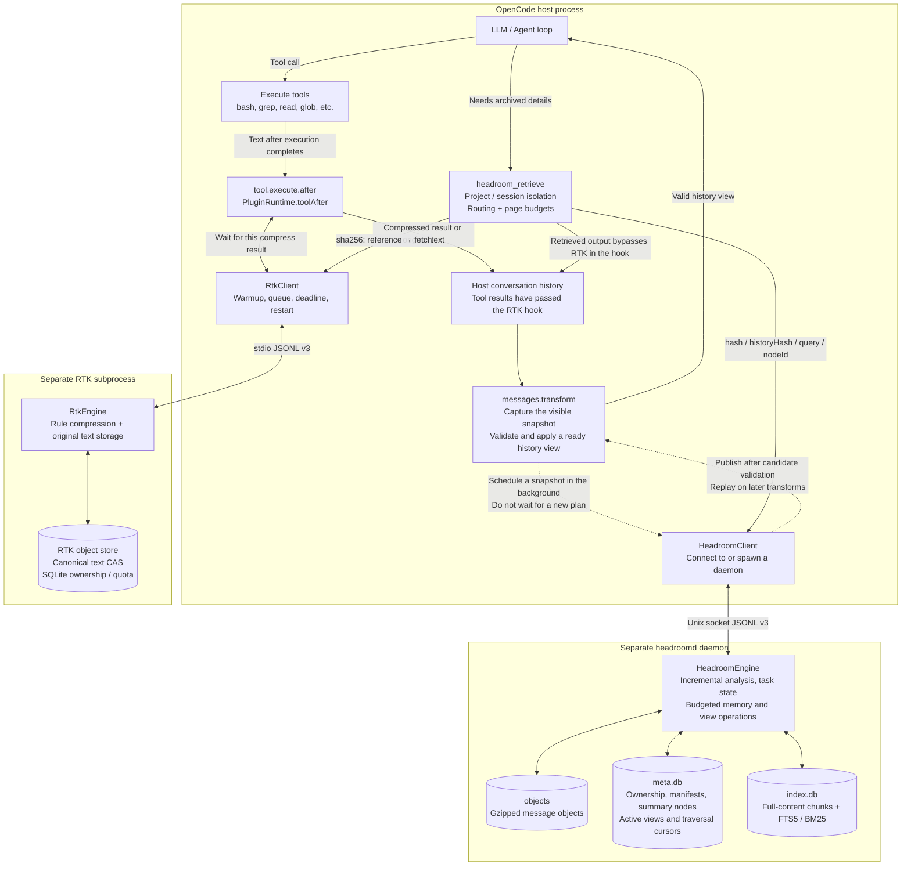
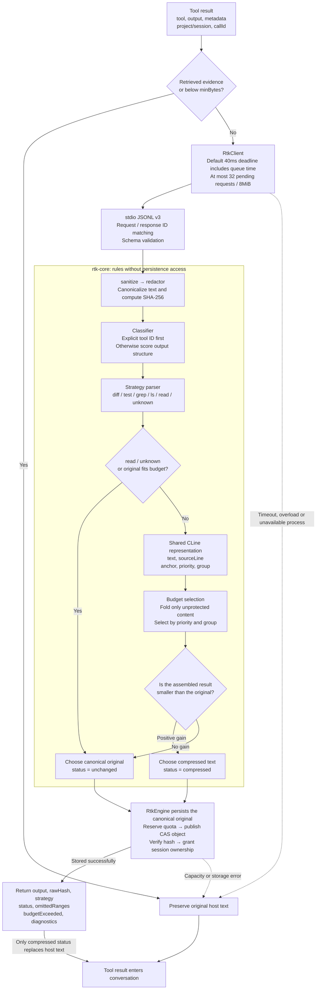
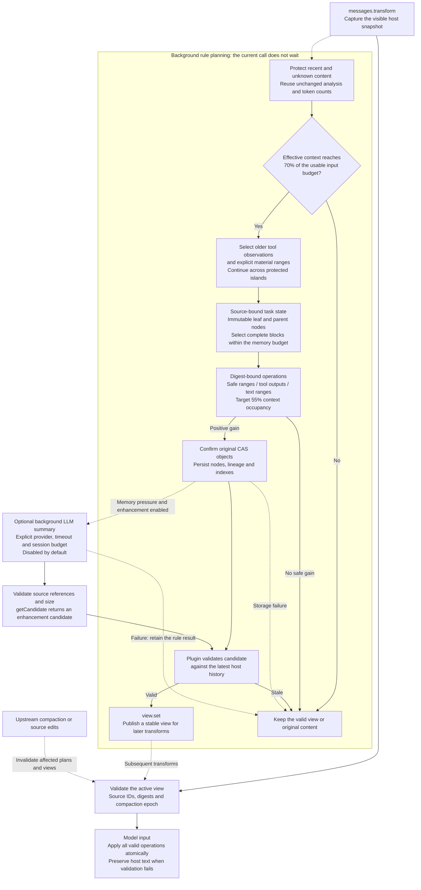

# BlueCode

Context engineering for [OpenCode](https://github.com/anomalyco/opencode): one plugin connects an RTK subprocess for tool-output compression and a headroomd daemon for budgeted, layered conversation memory and on-demand evidence recovery.

[简体中文](README.zh-CN.md) · [Architecture](docs/architecture.md) · [Headroom guide](docs/headroom-layered.md) · [Headroom results](docs/headroom-layered-acceptance.md) · [Operations](docs/operations.md)

This is an independent learning implementation, not vivo's private BlueCode source. Evaluation includes deterministic synthetic replays and small coding tasks executed by a real LLM through OpenCode; their metrics are reported separately.

## How it works

| Component | Responsibility |
|---|---|
| RTK | Condenses recognized command output, preserving code, changed diff lines and complete failure diagnostics. The 512-token target is soft; protected content can exceed it. |
| headroomd | Archives older tool observations and explicitly marked materials; maintains task state and budgeted hierarchical memory; reuses unchanged analysis and applies safe local replacements across protected content. User requirements, corrections, recent turns, active tools and unsupported content remain protected. |
| Plugin | Owns clients and state per instance; binds retrieval to actual project/session IDs; coordinates model limits and upstream compaction. |
| Retrieval | Returns FTS5/BM25 match snippets first, then expands original text, archive history or summary nodes through bounded cursors. Retrieval output bypasses RTK. |

The new headroom strategy is enabled with `headroom.strategy: "layered"`. The default remains `legacy` while rollout acceptance is incomplete. Both rule paths work offline; the optional background LLM summarizer is disabled by default. See the [configuration and acceptance decision](docs/headroom-layered-acceptance.md#默认策略决定).

RTK uses protocol v3 over stdio; headroomd uses protocol v3 over a Unix socket. Durable data lives outside temporary runtime sockets. Errors preserve host-visible content or pause planning; retrieval reports missing or corrupt archives explicitly. RTK stores the sanitized text it receives, which may already have been truncated by the host.

## Implementation architecture

RTK condenses individual tool results; headroomd controls how older evidence stays in the context. These three diagrams describe this repository's Bun / TypeScript implementation. The sidecars do not call each other: the host plugin owns orchestration and retrieval routing.

### Overview: two compression stages and a retrieval loop



RTK waits for a deadline-bounded compression call after a tool returns. Headroom plans in the background; before a model call, the plugin validates and applies a ready view. Clients and pure calculations run in the host, while databases and archive writes stay in separate processes. Retrieved evidence explicitly bypasses RTK so that recovery does not immediately fold it again.

Source: [plugin factory](packages/plugin/src/index.ts), [production runtime](packages/plugin/src/runtime.ts), [retrieval entry point](packages/plugin/src/retrieval.ts).

### Inside RTK: rules, protected anchors and durable originals



The default `minBytes=512` is a client byte threshold; `budgetTokens=512` is a soft compression target. Strategies mark protected content with `anchor`: `read` preserves full source text, `diff` protects all changes and file / hunk headers, and `test` protects failure diagnostics. `grep` and `ls` fold structural groups; `unknown` preserves the text. Protected content may exceed the target, reported through `budgetExceeded`.

CAS stores text after sanitize / redactor processing. The default redactor is identity, so this does not imply automatic secret removal. Compressed output carries retrieval instructions; storage failure preserves host text. Content truncated by the host before the hook cannot be recovered here.

Source: [client](packages/rtk/src/client.ts), [classifier](packages/rtk-core/src/classify.ts), [strategy pipeline](packages/rtk-core/src/pipeline.ts), [budget selection](packages/rtk-core/src/budget.ts), [storage and fallback](packages/rtk/src/engine.ts).

### Inside headroomd: layered memory, incremental planning and recovery

The diagram shows the opt-in `layered` strategy. `legacy` retains its contiguous-prefix planner. Layered planning protects the four recent complete turns and the active turn, keeps user requirements and corrections verbatim, and archives only older eligible observations and clearly identified material ranges.



The usable input budget is `min(input limit, context limit − output reserve) − estimated system tokens − 512`, using context when no separate input limit is available. Unknown windows pause planning. The default memory allocation is at most 4,096 tokens and 15% of usable input, further limited by protected content, recent history and the 55% target. Requirements are not truncated to meet that target. The daemon supports an injectable token counter; its default is `ceil(text.length / 4)`, distinct from provider usage.

Originals are confirmed before replacement. Task-state events retain source and version references; unchanged material reuses cached analysis. Immutable nodes allow bounded parent summaries without repeatedly concatenating all older memory. Full host-snapshot validation still requires a linear scan. Multiple non-overlapping operations are validated together, so protected attachments or active tools do not block eligible content elsewhere.

Retrieval supports `hash`, `historyHash`, `query` and `nodeId`. Queries return up to five short match cards; original text and nodes expand only when requested. The final JSON response includes its packaging in the token and byte budgets, with a default 2,048-token / 32 KiB limit. Source ownership remains project/session-scoped. Replacement changes the model-input view, without deleting persistent host history.

The optional summarizer uses an independent text API, outside the OpenCode Agent Loop. Rule plans return first; an enhancement can publish only after source and size validation plus a fresh host check. Provider errors, timeouts and stale candidates retain the rule result. Source validation establishes traceability, not semantic correctness.

Source: [runtime](packages/plugin/src/runtime.ts), [layered planner](packages/headroomd/src/layered.ts), [atomic operations](packages/headroomd/src/layered-operations.ts), [node storage](packages/headroomd/src/store/nodes.ts), [node retrieval](packages/headroomd/src/node-retrieval.ts), [background enhancement](packages/headroomd/src/enhancement-integration.ts). See the [guide](docs/headroom-layered.md) and [protocol](docs/protocol.md) for configuration, budgets and migration.

## Run locally

Use **Bun 1.4.0**. Linux and macOS are intended platforms. Local verification was on macOS; see the [CI runs](https://github.com/EthyleneC2H4/Bluecode/actions) for platform-specific results.

```sh
bun install --frozen-lockfile
bun run verify
bun run eval --check --skip-latency
bun run eval:headroom --output /tmp/headroom-layered-results.json
```

Verification runs strict workspace typechecks, tests, dependency checks and a host bundle check that rejects SQLite imports. The commands above run offline and require no model credentials. `eval:live` is a separate, opt-in command requiring an explicit model, credential environment variable and total call budget; it is excluded from default CI.

Mount the checkout through OpenCode's tuple-form configuration. This example explicitly enables `layered`; omitting `strategy` retains the `legacy` default:

```json
{
  "plugin": [["file:///absolute/path/Bluecode/packages/plugin/src/index.ts", {
    "mode": "on",
    "rtk": {"budgetTokens": 512, "timeoutMs": 40, "minBytes": 512},
    "headroom": {
      "strategy": "layered",
      "triggerRatio": 0.7,
      "targetRatio": 0.55,
      "retainRecentTurns": 4,
      "memoryMaxTokens": 4096,
      "summarizer": {"enabled": false}
    }
  }]]
}
```

The adapter was originally inspected against OpenCode **1.18.21** and the new live comparison ran on **1.18.23**. Some hooks are experimental. See [integration notes](docs/integration-notes.md) and [operations](docs/operations.md) for off/shadow/on, allowances, migration and recovery.

## Evaluation results

The three protocols below use different histories, counting methods and retrieval policies. Their percentages are not interchangeable. The [headroom acceptance report](docs/headroom-layered-acceptance.md) records configurations, raw data and remaining rollout gates.

### Real OpenCode coding tasks: legacy vs layered rules

Twelve small tasks, each repeated twice per strategy, used OpenCode **1.18.23** and Zen **`opencode/mimo-v2.5-free`**. Each task began with 14 synthetic history turns before the model performed real coding work. RTK was off throughout. This pressure configuration used a 40,000-token input window, 2,048 output limit and **128-token memory budget**, not the default 4,096.

| Main-model metric | legacy | layered rules |
|---|---:|---:|
| Tasks passing executable tests | 24 / 24 | 24 / 24 |
| Runs satisfying critical constraints | 24 / 24 | 24 / 24 |
| Cumulative input, including cache | 4,501,601 | 2,848,864 |
| Input outside the cache | 732,769 | 949,792 |
| Output tokens | 24,692 | 28,046 |

Layered rules reduced cumulative input by **36.71%**, while input outside the cache increased **29.62%** and output increased **13.58%**. Input includes `input + cacheRead + cacheWrite`; it is not equivalent to an uncached-token bill. These free-model runs do not establish paid-model cost savings or a production success rate.

A third arm attempted optional LLM summaries. All **72 main tasks** across the three arms passed, but **no enhanced summary was applied**: 31 summary requests received `MissingSessionID` and one failed in transport. Summary usage is unknown, so the enhancement comparison remains `incomplete: true`. This arm demonstrates rule fallback, not semantic-summary quality. See the [raw live results](packages/eval/headroom-live-results.json).

### Dedicated headroom offline replay

Eight scenarios at 50, 200 and 1,000 turns produce 24 histories, replayed through the production runtime and a real daemon. Counting uses `ceil(UTF-16 characters / 4)` and includes subsequent retrieval inputs; no external model is called.

| Observation | Result |
|---|---|
| Layered histories completed | 24 / 24 |
| Comparable legacy/layered pairs | 17 / 24; seven legacy 1,000-turn runs timed out |
| Cumulative estimated input for comparable pairs | 15,810,622 → 4,428,698 (**−71.99%**) |
| Repeated-output regressions, 50 / 200 turns | **+2.79% / +12.20%** input |
| Exact recovery of one preselected source per history | 24 / 24 |
| Natural-query evidence probes | 18 / 24; six first hits selected a different history version |
| Engineering replay with query plus first-hit expansion | 197,686 → 181,048 (**−8.42%**); both strategies retain 10/10 facts and 3/3 constraints |

Timeouts are excluded from savings, not counted as zero input. These observations and the pressure-only live configuration leave rollout gates open: **`legacy` remains the default and LLM enhancement stays disabled**. Raw records: [dedicated replay](packages/eval/headroom-layered-results.json).

### Frozen RTK + legacy headroom baseline

The original 11-fixture replay remains available for regression checks. It uses o200k_base over fixed input representations, repeated context and retrieved evidence, with `legacy` headroom and the original query-only policy.

| Configuration | Total input tokens |
|---|---:|
| A: passthrough | 582,501 |
| B: RTK | 464,781 |
| C: legacy headroomd | 529,923 |
| D: combined | 435,436 |

Combined input is **25.25%** lower than passthrough; eager full-document retrieval saves only **6.95%**. These are deterministic replay results, separate from the new headroom experiments and actual LLM task accuracy. See the [frozen evidence](docs/reliability-implementation.md), [baseline](packages/eval/baseline.json) and [evaluation CLI](packages/eval/README.md).

## Development

Seven packages separate contracts, shared primitives, pure RTK strategies, RTK transport/storage, headroomd, the plugin and evaluation. Evaluation imports the production runtime; sidecars remain independent. Legacy plugin helpers remain for compatibility tests, outside the production factory's import graph.

See [CONTRIBUTING.md](CONTRIBUTING.md), [protocol](docs/protocol.md), [layered design](docs/superpowers/specs/2026-09-11-headroom-layered-design.md) and [implementation plan](docs/superpowers/plans/2026-09-11-headroom-layered.md).

MIT; see [LICENSE](LICENSE). AI assisted implementation and documentation; architectural sources and license boundaries are recorded in the implementation report.
