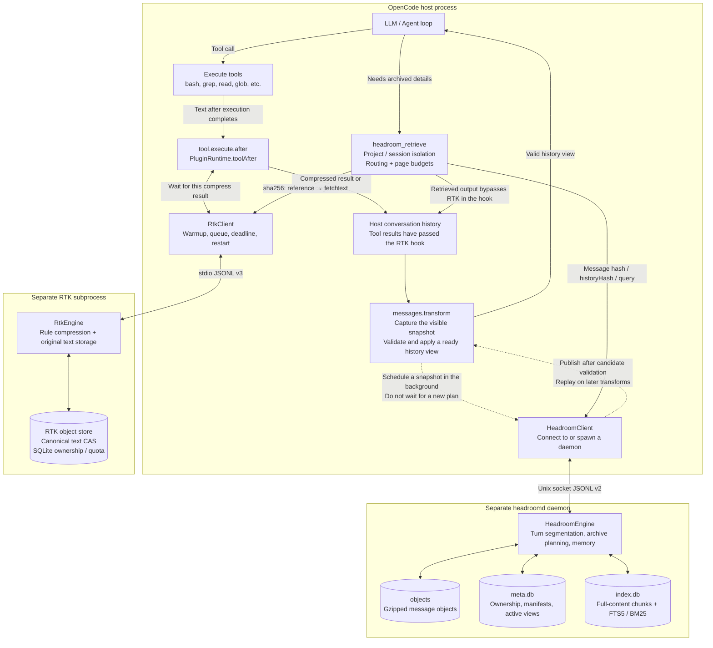
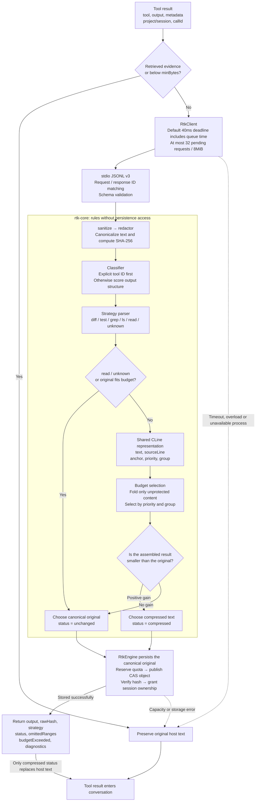
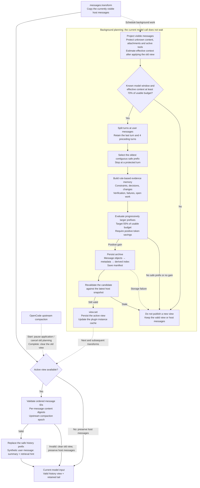

# BlueCode

Context engineering for [OpenCode](https://github.com/anomalyco/opencode): an RTK tool-output sidecar and a headroomd history archive, mounted through one plugin.

[简体中文](README.zh-CN.md) · [Architecture](docs/architecture.md) · [Operations](docs/operations.md) · [Implementation and evidence](docs/reliability-implementation.md)

This is an independent learning implementation, not vivo's private BlueCode source. Evaluation uses local synthetic data.

## How it works

| Component | Responsibility |
|---|---|
| RTK | Condenses recognized command output, preserving code, changed diff lines and complete failure diagnostics. The 512-token target is soft; protected content can exceed it. |
| headroomd | Archives completed turns, builds evidence memory, and persists a view that can be reapplied to each fresh host message array. Recent turns, active tools and unsupported content remain protected. |
| Plugin | Owns clients and state per instance; binds retrieval to actual project/session IDs; coordinates model limits and upstream compaction. |
| Retrieval | Searches full-content chunks with FTS5/BM25 and restores verified archives through bounded cursors. Retrieval output bypasses RTK. |

RTK uses protocol v3 over stdio; headroomd uses protocol v2 over a Unix socket. Durable data lives outside temporary runtime sockets. Errors preserve host-visible content or pause planning; retrieval reports missing or corrupt archives explicitly. RTK stores the sanitized text it receives, which may already have been truncated by the host.

## Implementation architecture

RTK condenses individual tool results; headroomd archives accumulated conversation history. These three diagrams describe this repository's Bun / TypeScript implementation. The sidecars do not call each other: the host plugin owns orchestration and retrieval routing.

### Overview: two compression stages and a retrieval loop



RTK waits for a deadline-bounded compression call after a tool returns. Headroom plans in the background; before a model call, the plugin validates and applies a ready view. Clients and pure calculations run in the host, while databases and archive writes stay in separate processes. Retrieved evidence explicitly bypasses RTK so that recovery does not immediately fold it again.

Source: [plugin factory](packages/plugin/src/index.ts), [production runtime](packages/plugin/src/runtime.ts), [retrieval entry point](packages/plugin/src/retrieval.ts).

### Inside RTK: rules, protected anchors and durable originals



The default `minBytes=512` is a client byte threshold; `budgetTokens=512` is a soft compression target. Strategies mark protected content with `anchor`: `read` preserves full source text, `diff` protects all changes and file / hunk headers, and `test` protects failure diagnostics. `grep` and `ls` fold structural groups; `unknown` preserves the text. Protected content may exceed the target, reported through `budgetExceeded`.

CAS stores text after sanitize / redactor processing. The default redactor is identity, so this does not imply automatic secret removal. Compressed output carries retrieval instructions; storage failure preserves host text. Content truncated by the host before the hook cannot be recovered here.

Source: [client](packages/rtk/src/client.ts), [classifier](packages/rtk-core/src/classify.ts), [strategy pipeline](packages/rtk-core/src/pipeline.ts), [budget selection](packages/rtk-core/src/budget.ts), [storage and fallback](packages/rtk/src/engine.ts).

### Inside headroomd: background planning and active view replay



The usable input budget is `min(input limit, context limit − output reserve) − estimated system tokens − 512`, using context when no separate input limit is available. Unknown windows pause planning. Runtime thresholds and planning use `ceil(text.length / 4)`; exact tokenization is reserved for offline evaluation. Retrieval pages separately use UTF-8 bytes as a conservative token upper bound.

Memory uses rule-based categorization and exact repetition folding, without an LLM call. User text stays verbatim; tool `input/output/error` all participate, and each memory entry carries `sourceIds`. A plan includes ordered `replacedMessageIds`, `sourceDigests`, an `epoch`, a summary and archive references. Each transform validates and replays it: tail appends can preserve an existing prefix, while source edits, removal, reordering or an upstream epoch change invalidate the old plan.

Message objects use content hashes and are checked against their schema and hash on read. `meta.db` owns attribution, manifests, archive lineage and active views; `index.db` holds rebuildable full-text indexes. Replacement affects the model-input view and does not delete the host's persistent history through this path.

Source: [scheduling and budgets](packages/plugin/src/runtime.ts), [host projection and replacement](packages/plugin/src/host-adapter.ts), [archive engine](packages/headroomd/src/engine.ts), [memory builder](packages/headroomd/src/memory.ts), [plan validation](packages/headroomd/src/compaction.ts), [active view persistence](packages/headroomd/src/store/manifests.ts). See [protocol](docs/protocol.md) for the complete interfaces.

## Run locally

Use **Bun 1.4.0**. Linux and macOS are intended platforms. Local verification was on macOS; Linux has a configured CI job, with execution results pending.

```sh
bun install --frozen-lockfile
bun run verify
bun run eval --check --skip-latency
```

Verification runs strict workspace typechecks, tests, dependency checks and a host bundle check that rejects SQLite imports. Evaluation requires no model credentials.

Mount the checkout through OpenCode's tuple-form configuration:

```json
{
  "plugin": [["file:///absolute/path/Bluecode/packages/plugin/src/index.ts", {
    "mode": "on",
    "rtk": {"budgetTokens": 512, "timeoutMs": 40, "minBytes": 512},
    "headroom": {"triggerRatio": 0.7, "targetRatio": 0.55, "retainRecentTurns": 4}
  }]]
}
```

The adapter targets the inspected OpenCode **1.18.21** API. Some hooks are experimental. See [integration notes](docs/integration-notes.md) and [operations](docs/operations.md) for off/shadow/on, allowances, migration and recovery.

## Measured replay

Eleven fixtures run through four configurations using the production plugin runtime. The o200k_base count covers all fixed model-input representations, repeated context, question calls and retrieval evidence.

| Configuration | Total input tokens |
|---|---:|
| A: passthrough | 582,501 |
| B: RTK | 464,781 |
| C: headroomd | 529,923 |
| D: combined | 435,436 |

The combined query-only replay saves **25.25%** total input. Natural-question Recall@5 is 10/10 in C/D; each group preserves 3/3 designated critical constraints and passes 10/10 deterministic answer checks. D restores 108/108 archive items exactly. Ordinary legacy context facts remain 102/104 in B/D and are reported separately.

These are deterministic content checks, not measured LLM task-solving accuracy or provider billing. Eager full-document retrieval saves only **6.95%**, failing the 20% cost target. At 32 concurrent calls, RTK degrades 13 times under its 40ms deadline. See [full evidence and limitations](docs/reliability-implementation.md) and [evaluation CLI](packages/eval/README.md).

## Development

Seven packages separate contracts, shared primitives, pure RTK strategies, RTK transport/storage, headroomd, the plugin and evaluation. Evaluation imports the production runtime; sidecars remain independent. Legacy plugin helpers remain for compatibility tests, outside the production factory's import graph.

See [CONTRIBUTING.md](CONTRIBUTING.md), [protocol](docs/protocol.md), [design](docs/superpowers/specs/2026-09-05-reliability-design.md) and [implementation plan](docs/superpowers/plans/2026-09-05-reliability.md).

MIT; see [LICENSE](LICENSE). AI assisted implementation and documentation; architectural sources and license boundaries are recorded in the implementation report.
