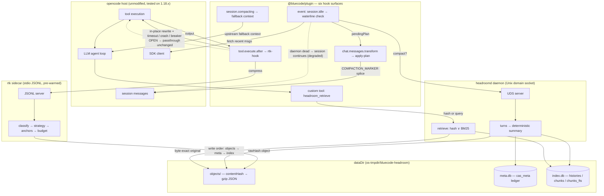

<div align="center">

# BlueCode

**Context-engineering sidecars for [opencode](https://github.com/anomalyco/opencode)** —
compress tool output in the hot path, archive long-session history behind a searchable store,
and degrade to transparent passthrough instead of ever losing a byte.

[](https://github.com/EthyleneC2H4/Bluecode/actions/workflows/ci.yml)
[](LICENSE)
[](https://bun.sh)
[](tsconfig.base.json)
[](#quick-start)

[Features](#features) · [Architecture](#architecture) · [Packages](#packages) · [Quick Start](#quick-start) · [Benchmarks](#benchmarks) · [Documentation](#documentation)

English · [简体中文](README.zh-CN.md)

</div>

---

## Why

Long-running coding-agent sessions slowly drown their context window: every `ls`, `grep`,
test run and log dump lands verbatim in the transcript, and turn history keeps piling up.
Sooner or later the host silently truncates or compacts — and the detail your task still
depends on vanishes mid-flight.

BlueCode attacks both paths from a single opencode plugin, **with zero changes to the host core**:

| Sidecar | Transport | Job |
|---|---|---|
| **rtk** | stdio JSONL, pre-warmed resident process | Classify each tool result and compress it to a token budget — anchors preserved, byte-exact original stored for retrieval |
| **headroomd** | Unix domain socket daemon | Watch a per-session token waterline; when it trips, replace aged turns with a deterministic summary backed by a SQLite/FTS archive |

Every elided byte stays retrievable via the `headroom_retrieve` tool (exact hash lookup or
BM25 full-text query), and every failure mode degrades to *unchanged passthrough* — never to
silent data loss.

## Features

- **Zero-core-change mounting** — rides documented hook surfaces plus opencode's tuple-form
  plugin options (`"plugin": [["file://…", options]]`). Six surfaces wired:
  `tool.execute.after`, `experimental.chat.messages.transform`, `experimental.session.compacting`,
  `event` (idle waterline), custom tool `headroom_retrieve`, and `dispose`.
- **Hot-path compression (rtk)** — two-tier classifier picks one of six strategies
  (`ls | grep | read | diff | test | fallback`), protects anchor lines by priority, trims to a
  token budget, folds elided runs into `[+N lines elided …]` markers, and stamps
  `metadata.bluecode { rawHash, strategy, compressed }` onto the rewritten output.
- **Long-session daemon (headroomd)** — on `session.idle`, when projected tokens cross
  `contextWindow × triggerRatio` (default `0.7`), turns are segmented, summarized by a fully
  deterministic extractive summarizer (no LLM, no clock, no randomness — byte-stable), archived,
  and replaced by a single `COMPACTION_MARKER` message carrying per-turn hash refs.
- **Nothing-lost retrieval** — originals are kept byte-exact as gzip objects addressed by logical
  content hash (CAS with atomic publish); retrieval supports exact-hash mode and FTS5 BM25 query
  mode with CJK-aware pre-segmentation and session-scoped predicates.
- **Failure containment matrix** — per-request timeout → crash detection → exponential restart
  backoff → circuit breaker with periodic recovery probes; any failure yields unchanged
  passthrough tagged `metadata.bluecode.degraded`. The conversation never notices.
- **Rebuildable storage** — split-durability design: the ownership ledger (`meta.db`) is durable;
  the derived search index (`index.db`) can be deleted at any time and self-heals on startup by
  rebuilding from CAS objects.
- **Reproducible eval harness + regression gate** — four controlled groups driving real sidecar
  clients over deterministic seeded fixtures, exact o200k_base token counts, and a baseline gate
  (`--check`) that fails CI on quality regressions.

## Architecture



Three data paths:

1. **Hot path (synchronous)** — every finished tool call flows through rtk; compressed text is
   rewritten in place before the model sees it. Outputs ≤ 512 bytes take a client-side fast path
   with no IPC at all.
2. **Idle path (asynchronous)** — when the session goes idle above the token waterline,
   headroomd summarizes and archives aged turns; the plan is applied on the next message
   transform.
3. **Retrieval path** — the model calls `headroom_retrieve` with a rawHash (byte-exact original)
   or a free-text query (ranked BM25 hits from the archive).

If either sidecar dies mid-session, that path degrades gracefully — passthrough for rtk,
compaction pause for headroomd — while the rest of the session carries on. Restart the host to
recover the failed component.

## Packages

| Package | Role | Highlights |
|---|---|---|
| [`@bluecode/contracts`](packages/contracts) | Wire-protocol schemas & shared error codes | zod schemas for both protocols, ChatMessage projection |
| [`@bluecode/shared`](packages/shared) | Primitives | JSONL framing, CAS, ANSI stripping, exact token counting, redaction hooks |
| [`@bluecode/rtk-core`](packages/rtk-core) | Pure compression pipeline | classifier + six strategies + anchor protection + budget trimming (no I/O) |
| [`@bluecode/rtk`](packages/rtk) | stdio JSONL sidecar | pre-warmed server + degradation-matrix client (warmup / timeout / restart / circuit breaker) |
| [`@bluecode/headroomd`](packages/headroomd) | UDS history daemon | turn segmentation, deterministic summaries, SQLite/FTS archive, startup self-heal |
| [`@bluecode/plugin`](packages/plugin) | opencode plugin | six hook surfaces wiring both sidecars — zero core changes |
| [`@bluecode/eval`](packages/eval) | Evaluation harness | four-group A/B/C/D runner, golden-fact metrics, baseline freeze + gate |

~8.1k lines of source, ~4.8k lines of tests across 35 test files. Dependency direction:
`plugin → {rtk, headroomd} → {contracts, shared}` — leaf packages never depend on each other.

## Quick Start

Requires [Bun](https://bun.sh) ≥ 1.4 (tested on Bun 1.4.0). No LLM API key is needed to build,
test or evaluate — only for live sessions.

```bash
git clone https://github.com/EthyleneC2H4/Bluecode.git bluecode
cd bluecode
bun install

bun run verify            # typecheck all workspaces + full test suite
bun run eval --quick      # reduced fixture set (harness smoke)
bun run eval              # full A/B/C/D run → packages/eval/eval-report.json
bun run eval --check      # regression gate vs packages/eval/baseline.json (exit 1 on violation)
```

### Mount into a real opencode project

Add the tuple-form entry to your project's `opencode.json` (path must be an absolute `file://`
URL pointing at the checked-out `packages/plugin`):

```jsonc
{
  "plugin": [
    [
      "file:///absolute/path/to/bluecode/packages/plugin",
      {
        "enabled": true,
        "rtk":      { "budgetTokens": 512, "timeoutMs": 40, "minBytes": 512 },
        "headroom": { "triggerRatio": 0.7, "retainRecentTurns": 4, "fallback": "upstream" }
      }
    ]
  ]
}
```

Then start opencode in a scratch directory. Live verification follows the ten-step checklist in
[`scripts/smoke.md`](scripts/smoke.md).

> [!NOTE]
> Hook compatibility is verified against **opencode 1.18.x**. Some mounted surfaces are
> upstream `experimental.*` APIs and may change in future opencode releases.

## Benchmarks

Frozen eval baseline ([`packages/eval/baseline.json`](packages/eval/baseline.json), frozen
2026-08-23): quick fixture set, exact o200k_base token counting, Bun 1.4.0. Regenerate anytime
with `bun run eval --check`.

| Group | Configuration | Compression ratio¹ (lower = smaller context) | Must-hit recall² | Degraded rate |
|---|---|---:|---:|---:|
| A | passthrough baseline | 100% | — ⁵ | 0 |
| B | rtk only | **41.7%** | 66/77 (85.7%) | 0 |
| C | headroomd only | **18.0%** | 71/77 (92.2%) | 0 |
| D | combined (rtk → headroomd) | **7.4%** ⁶ | 65/77 (84.4%) | 0 |

On the long-session fixture, headroomd reduces accumulated history from **51,083 → 273 tokens**.

<details>
<summary><b>Methodology & caveats</b></summary>

1. **Compression ratio** = Σ outTokens / Σ rawTokens, token-weighted across the group's fixtures,
   exact o200k_base counts (raw total 61,930 tokens per group; B out 25,845, C out 11,120,
   D out 4,589).
2. **Recall** uses this project's deliberately generous definition — *"retrievable from
   headroomd counts as not lost"*: a golden fact hits if it survives by substring in the
   compressed output, in any retrieved snippet, or in its fetch-by-hash original. Per-item miss
   lists live in `eval-report.json → perFixture[].recallMisses`. Residual B/D misses are a
   deliberate middle-window truncation policy; C misses are tail turns newer than
   `retainRecentTurns`.
3. The frozen baseline covers the **quick fixture set** (4 deterministic fixtures per group).
   Run the full fixture set with `bun run eval`.
4. Latency was measured per-stage in-harness (IPC time on synthetic fixtures); it is reported in
   the baseline JSON but deliberately **not** marketed as end-to-end agent speed-up. C's tiny
   p50 reflects that single tool outputs rarely meet the compaction watermark — by design it
   leaves small outputs untouched.
5. Group A transforms nothing, so no golden facts are probed.
6. **D is a lower-bound approximation**: the harness measures the two stages independently
   (summary computed from pre-rtk history), whereas the real plugin chain lets headroomd read
   the session *after* rtk rewrote it — real-world combined savings should be ≥ 7.4%.
7. Every quantitative claim in this repository traces to
   [`packages/eval/baseline.json`](packages/eval/baseline.json); aspirational numbers are always
   labeled as targets and never mixed with measurements.

</details>

## Documentation

| Document | Contents |
|---|---|
| [`docs/architecture.md`](docs/architecture.md) | Package layout, rtk/headroomd data flows, key design decisions |
| [`docs/protocol.md`](docs/protocol.md) | Wire specs: rtk over stdio JSONL, headroomd over UDS — framing, ops, errors |
| [`docs/integration-notes.md`](docs/integration-notes.md) | Upstream hook verification records vs opencode v1.18.21 (exact file:line citations) |
| [`docs/devlog.md`](docs/devlog.md) | All 34 development entries: hardest bugs, root causes, fixes, lessons |
| [`scripts/smoke.md`](scripts/smoke.md) | Ten-step live-session verification checklist |
| [`scripts/refresh-upstream.sh`](scripts/refresh-upstream.sh) | Re-sync the read-only opencode upstream snapshot used for hook verification |

## Project layout

```
bluecode/
├── package.json              # bun workspace root: test / typecheck / eval / verify
├── tsconfig.base.json
├── docs/                     # architecture, protocol, integration notes, devlog
├── scripts/                  # smoke checklist + upstream snapshot refresher
└── packages/
    ├── contracts/            # wire-protocol zod schemas & error codes
    ├── shared/               # JSONL framing, CAS, ANSI strip, token count
    ├── rtk-core/             # pure compression pipeline
    ├── rtk/                  # stdio sidecar server + client
    ├── headroomd/            # UDS daemon + SQLite/FTS archive
    ├── plugin/               # opencode plugin (six hooks)
    └── eval/                 # A/B/C/D harness + baseline gate
```

## Contributing

Issues and pull requests are welcome. Before submitting:

```bash
bun run verify          # typecheck + tests
bun run eval --check    # benchmark regression gate
```

Please re-freeze the eval baseline (`bun run eval --update-baseline`) only for intentional
behavior changes, and say so in the PR.

## Acknowledgments

- [opencode](https://github.com/anomalyco/opencode) — the open-source coding agent BlueCode
  plugs into. The plugin mechanism, hook surfaces and SDK shapes it exposes made this
  zero-core-change design possible.
- Built with [Bun](https://bun.sh), TypeScript, zod and SQLite/FTS5.

## License

[MIT](LICENSE) © wangyixi
