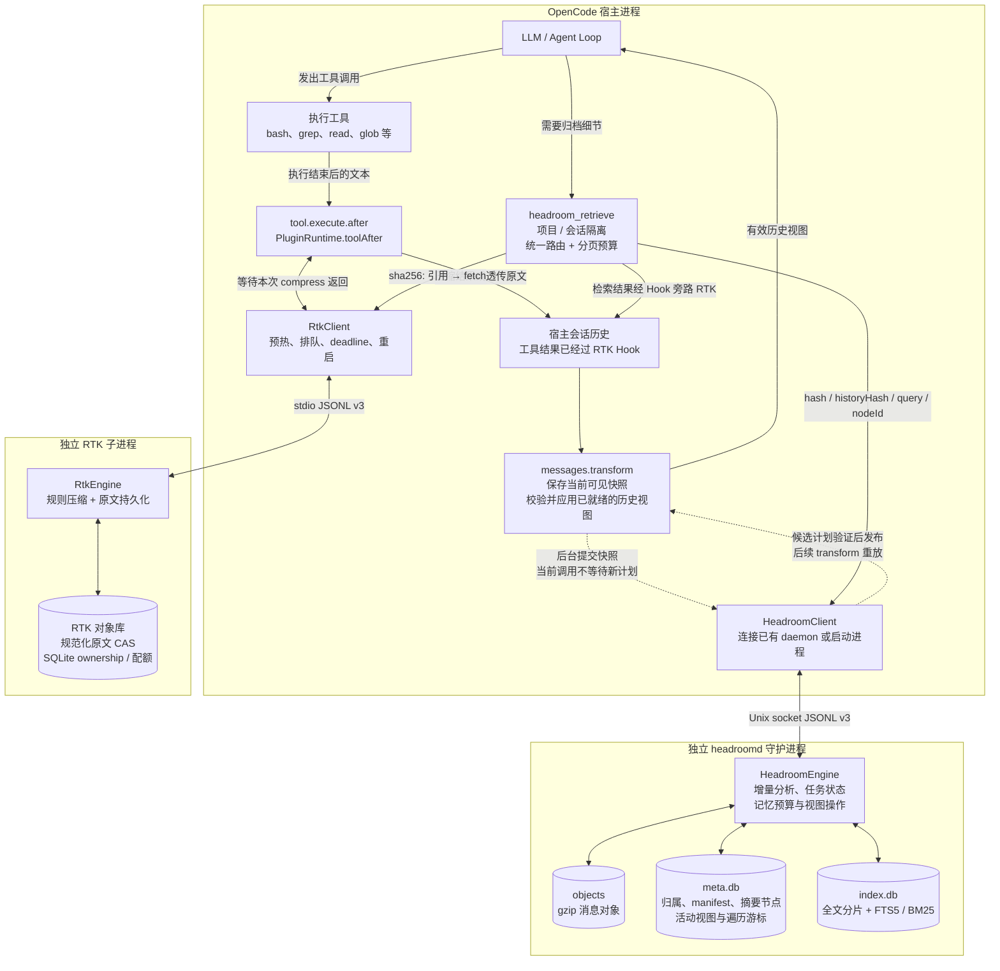
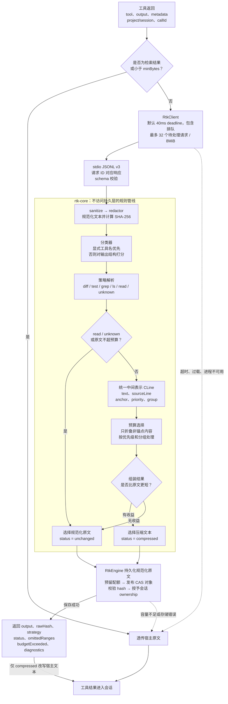
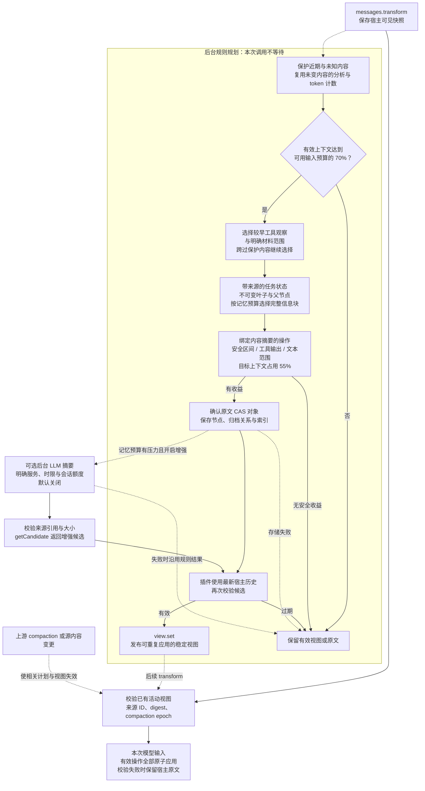

# BlueCode

为 [OpenCode](https://github.com/anomalyco/opencode) 提供上下文优化：通过一个插件连接 RTK 子进程与 headroomd 守护进程，分别负责工具输出压缩，以及有预算的分层会话记忆与证据按需恢复。

[English](README.md) · [架构](docs/architecture.md) · [Headroom 使用指南](docs/headroom-layered.md) · [Headroom 消融结果](docs/headroom-retention.md) · [操作手册](docs/operations.md)

本仓库是独立学习实现，不是 vivo 的 BlueCode 私有源码。评测包括确定性合成历史回放，以及通过真实 OpenCode 调用 LLM 完成的小型编码任务，两者分别报告。

## 工作方式

| 组件 | 职责 |
|---|---|
| RTK | 保守压缩已识别的命令输出，保护代码、diff 变更行和完整失败诊断。512 token 是软目标，保护内容允许超额。 |
| headroomd | 归档较早的工具观察和明确标注的材料，维护任务状态与有预算的分层记忆，复用未变内容的分析，并跨过保护内容进行安全局部替换；保护用户需求、修正、近期轮次、活动工具及未知内容。 |
| 插件 | 每实例拥有客户端与状态，以真实 project/session 隔离检索；根据模型窗口规划，与上游 compaction 协调。 |
| 检索 | FTS5/BM25 先返回命中片段，再按需分页展开原文、归档历史或摘要节点；返回内容绕过 RTK。 |

通过 `headroom.strategy: "layered"` 启用新策略。默认仍为 `legacy`，等待完整切换验收；两种规则路径均可离线运行，可选的后台 LLM 摘要默认关闭。详见[配置与默认策略决定](docs/headroom-layered-acceptance.md#默认策略决定)。

RTK 使用 stdio 协议 v3，headroomd 使用 Unix socket 协议 v3。持久数据与临时 socket 分离。故障保留宿主可见内容或暂停规划；归档缺失、损坏会显式报告。RTK 保存实际收到文本的 sanitized 版本，无法恢复进入 hook 前已被宿主截去的内容。

## 实现架构

RTK 压缩单次工具返回，headroomd 管理较早证据在上下文中的保留方式。下面三张图对应本仓库当前的 Bun / TypeScript 实现；两个 sidecar 互不调用，由宿主插件负责调度和检索路由。

### 总体架构：两层压缩与检索闭环



RTK 在工具返回后等待一次有 deadline 的压缩调用；headroomd 在后台规划，模型调用前只验证和应用已就绪的视图。宿主加载客户端与纯计算入口，数据库和归档写入留在独立进程中。检索结果明确绕过 RTK，避免刚恢复的证据再次被折叠。

源码：[插件工厂](packages/plugin/src/index.ts)、[生产运行时](packages/plugin/src/runtime.ts)、[统一检索入口](packages/plugin/src/retrieval.ts)。

### RTK 内部：规则压缩、锚点保护与原文持久化



默认 `minBytes=512` 是客户端的字节门槛，`budgetTokens=512` 是压缩的软目标，两者含义不同。策略通过 `anchor` 标记不可删除的内容：`read` 保留完整源码，`diff` 保护所有变更行和文件 / hunk 头，`test` 保护失败诊断；`grep` 和 `ls` 按结构分组折叠，`unknown` 保守透传。保护内容可以超过预算，并通过 `budgetExceeded` 报告。

CAS 保存的是 sanitize / redactor 之后的文本；默认 redactor 为 identity，不代表自动脱敏。压缩结果包含回取提示，原文保存失败则保留宿主文本。进入 Hook 前已被宿主截去的内容不在可恢复范围内。

源码：[客户端](packages/rtk/src/client.ts)、[分类器](packages/rtk-core/src/classify.ts)、[策略管线](packages/rtk-core/src/pipeline.ts)、[预算选择](packages/rtk-core/src/budget.ts)、[存储与降级](packages/rtk/src/engine.ts)。

### headroomd 内部：分层记忆、增量规划与按需恢复

下图展示需显式启用的 `layered` 策略；`legacy` 保留连续前缀规划方式。分层规划保护最近一个完整轮次及当前活动轮次（`retainRecentTurns` 可配置），需求与明确修正保持原文，只归档较早的可处理观察结果和明确属于材料的文本范围。



可用输入预算为 `min(input 上限, context 上限 − 输出预留) − 系统提示估算 tokens − 512`；缺少独立 input 上限时使用 context，窗口未知时暂停规划。默认历史记忆最多占 4,096 token 和可用输入的 15%，还受到保护内容、近期原文及 55% 目标水位限制；不会截断需求来满足目标。daemon 支持注入 token 计数器，默认采用 `ceil(text.length / 4)` 估算，与 provider usage 分开报告。

原文确认归档后才允许替换。任务状态事件保留来源与版本，未变材料复用分析缓存；不可变节点支持有预算的上层摘要，避免反复拼接全部旧记忆。完整宿主快照校验仍需线性扫描。多个互不重叠的操作一并验证，受保护的附件或活动工具不会阻止其他位置的安全内容参与优化。

检索支持 `hash`、`historyHash`、`query` 和 `nodeId`。查询先给最多五个简短命中卡片，按需展开原文或节点；最终 JSON 包装也参与 token 和字节预算，默认上限为 2,048 token / 32 KiB。来源继续按项目／会话隔离。替换作用于模型输入视图，不删除宿主持久历史。

可选摘要服务通过独立文本 API 调用，不经过 OpenCode Agent Loop。规则计划先返回，增强候选经来源、大小及最新宿主历史校验后才能发布；网络失败、超时、候选过期时保留规则结果。来源校验只证明可追溯，不能证明摘要语义正确。

源码：[运行时](packages/plugin/src/runtime.ts)、[分层规划器](packages/headroomd/src/layered.ts)、[原子操作](packages/headroomd/src/layered-operations.ts)、[节点存储](packages/headroomd/src/store/nodes.ts)、[节点检索](packages/headroomd/src/node-retrieval.ts)、[后台增强](packages/headroomd/src/enhancement-integration.ts)。配置、预算和迁移详见[使用指南](docs/headroom-layered.md)与[协议](docs/protocol.md)。

## 本地运行

使用 **Bun 1.4.0**。目标平台为 Linux/macOS；本次本地验证在 macOS 完成，Linux 已配置 CI，执行状态见[实际流水线](https://github.com/EthyleneC2H4/Bluecode/actions)。

```sh
bun install --frozen-lockfile
bun run verify
bun run eval --check --skip-latency
bun run eval:headroom --output /tmp/headroom-layered-results.json
```

verify 包含全工作区 strict 类型检查、测试、依赖方向，以及宿主 bundle 不引入 SQLite 的检查。上述命令均离线运行，不需要模型密钥。`eval:live` 是独立的实机入口，必须显式指定模型、密钥环境变量及总调用预算，不进入默认 CI。

在 OpenCode 配置中挂载当前 checkout。下面显式启用 `layered`；省略 `strategy` 时仍使用默认的 `legacy`：

```json
{
  "plugin": [["file:///absolute/path/Bluecode/packages/plugin/src/index.ts", {
    "mode": "on",
    "rtk": {"budgetTokens": 512, "timeoutMs": 40, "minBytes": 512},
    "headroom": {
      "strategy": "layered",
      "triggerRatio": 0.7,
      "targetRatio": 0.55,
      "retainRecentTurns": 1,
      "memoryMaxTokens": 4096,
      "summarizer": {"enabled": false}
    }
  }]]
}
```

宿主适配最初基于 OpenCode **1.18.21** 检查，本轮真实模型对照使用 **1.18.23**；部分 hook 属于 experimental API。参见[集成记录](docs/integration-notes.md)与[操作手册](docs/operations.md)，后者涵盖 off/shadow/on、配额、迁移和恢复。

## 实验结果

以下三类实验采用不同历史、计数方法和检索策略，百分比不能混用。[Headroom 验收报告](docs/headroom-layered-acceptance.md)记录了具体配置、原始数据与尚未完成的默认切换门槛。

### RTK＋当前分层 headroom：四组消融

正式 A/B/C/D 回放在 C/D 中使用 **`layered` headroom、保留 1 个完整历史轮次及当前活动轮次、关闭 LLM 摘要**。原有 11 份 fixture 使用 o200k_base 计数，固定四个历史阶段、每阶段两次全新宿主调用及 query-only 检索策略。记忆预算为 4,096 token；插件默认策略仍为 `legacy`，显式启用 layered 后默认保留一轮。

| 配置 | 总输入 token | 相对 A 减少 |
|---|---:|---:|
| A：关闭优化 | 582,501 | — |
| B：仅 RTK | 464,781 | 20.21% |
| C：仅分层 headroom | 391,029 | 32.87% |
| D：RTK＋分层 headroom | 338,584 | **41.87%** |

组合相对仅 RTK 进一步减少输入 **27.15%**。C/D 的关键约束均为 3/3、确定性答案 10/10、自然问题 Recall@5 为 10/10；所选归档逐字恢复为 34/34 和 66/66，三类安全违规均为零。B/D 普通上下文事实仍为 102/104，与关键约束单独统计。

保留轮数 0～4 的对照固定了其他配置，轮数均不包含当前活动轮次：

| 保留完整历史轮数 | 组合输入 token | 相对关闭优化减少 | 组合可见上下文事实 |
|---|---:|---:|---:|
| 4 | 369,220 | 36.61% | 102/104 |
| 3 | 354,615 | 39.12% | 102/104 |
| 2 | 345,875 | 40.62% | 102/104 |
| **1（采用）** | **338,584** | **41.87%** | **102/104** |
| 0 | 331,464 | 43.10% | 99/104 |

一轮相对四轮进一步减少 **8.30%** 输入，现有质量指标不退步。零轮更省 token，但额外移出三条可见事实，因此采用一轮。24 份专用历史的交叉检查同样没有新增质量失败，累计输入估算下降 **4.10%**；已有六例旧版本首命中问题仍保留。

一轮配置在 **eager-recovery** 压力组中输入为 **428,885** token，相对 A 减少 **26.37%**。正式组和压力组均通过绝对门禁。此前四轮压力组的 19.72% 是另一保留配置的结果，继续保存在历史报告中。这些都是离线回放，未新增真实 LLM 调用。

一轮组合相对旧版 legacy 组合 435,436 token 减少 **22.24%**。详见[轮数实验与选择依据](docs/headroom-retention.md)、[全部原始数据清单](packages/eval/retention-results/manifest.json)、[一轮正式数据](packages/eval/retention-results/query-only-1.json)及[压力数据](packages/eval/retention-results/eager-recovery-1.json)。[原四轮实验](docs/headroom-ablation.md)和[旧基线](packages/eval/baseline.json)保持独立。

### 真实 OpenCode 编码任务：旧版与分层规则版

以下为保留四轮配置的历史实机结果，未因本轮调参重新调用模型。12 个小型任务，每种策略各重复两次，通过 OpenCode **1.18.23** 调用 Zen **`opencode/mimo-v2.5-free`**。每个任务先导入 14 轮合成历史，再由真实模型完成编码工作，RTK 全程关闭。压力配置使用 40,000 token 输入窗口、2,048 输出上限及 **128 token 记忆预算**，不是默认的 4,096。

| 主模型指标 | legacy | layered 规则版 |
|---|---:|---:|
| 可执行测试通过 | 24 / 24 | 24 / 24 |
| 关键约束通过 | 24 / 24 | 24 / 24 |
| 累计输入，含缓存 | 4,501,601 | 2,848,864 |
| 未命中缓存的输入 | 732,769 | 949,792 |
| 输出 token | 24,692 | 28,046 |

规则版累计输入降低 **36.71%**，同时未命中缓存的输入增加 **29.62%**，输出增加 **13.58%**。累计输入按 `input + cacheRead + cacheWrite` 计算，不等同于缓存外 token 的计费量。本次免费模型实验尚不能证明付费账单下降，也不能据小任务样本推断生产成功率。

第三组尝试启用 LLM 摘要。三组共 **72 次主任务全部通过**，但**没有增强摘要实际应用**：31 次摘要请求收到 `MissingSessionID`，1 次传输失败。摘要 usage 未知，增强对照仍标记为 `incomplete: true`；该组验证了规则回退，不能作为语义摘要质量的证据。见[实机原始结果](packages/eval/headroom-live-results.json)。

### Headroom 专用离线回放

8 类场景分别覆盖 50、200、1,000 轮，共 24 份历史，调用生产 runtime 和真实 daemon。按 `ceil(UTF-16 字符数 / 4)` 估算，并计入检索后的重复输入，不调用外部模型。

| 观察项 | 结果 |
|---|---|
| 分层规则版完成 | 24 / 24 |
| 新旧可比较组 | 17 / 24；旧版七个 1,000 轮组超时 |
| 可比较组累计估算输入 | 15,810,622 → 4,428,698（**降低 71.99%**） |
| 重复输出 50 / 200 轮的回归 | 输入**增加 2.79% / 12.20%** |
| 每组一个预选来源的逐字恢复 | 24 / 24 |
| 自然查询证据探针 | 18 / 24；六个首命中选中了其他历史版本 |
| 工程回放：查询＋首命中展开 | 197,686 → 181,048（**降低 8.42%**）；两组事实 10/10、约束 3/3 |

超时组不参与收益计算，不按零输入处理。结合上述回归和实机压力配置的适用范围，默认切换门槛仍未全部满足：**默认保留 `legacy`，LLM 增强继续关闭**。原始数据见[专用回放结果](packages/eval/headroom-layered-results.json)。

## 开发

七个工作区包分离协议、基础原语、RTK 纯策略、RTK 传输与存储、headroomd、插件及评测。评测直接依赖生产 runtime，两个 sidecar 互不依赖。旧插件 helper 保留用于兼容测试，不在生产工厂导入链路内。

参见[贡献指南](CONTRIBUTING.md)、[协议](docs/protocol.md)、[分层设计](docs/superpowers/specs/2026-09-11-headroom-layered-design.md)、[实施计划](docs/superpowers/plans/2026-09-11-headroom-layered.md)。

MIT，见 [LICENSE](LICENSE)。实现和文档由 AI 辅助完成；参考项目及许可边界列于验收记录。
