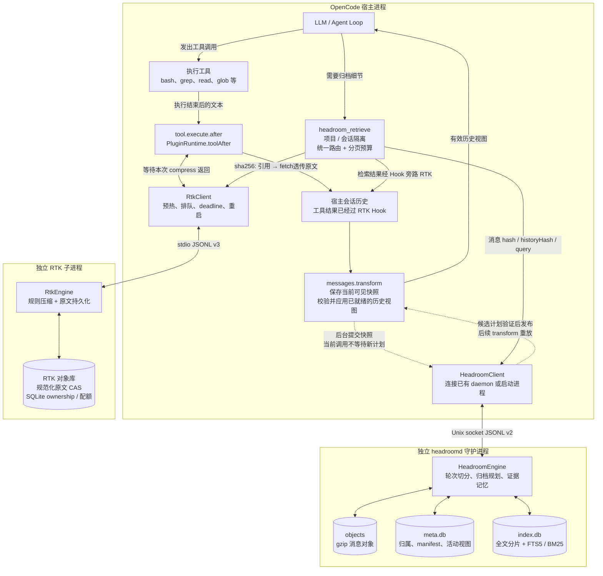
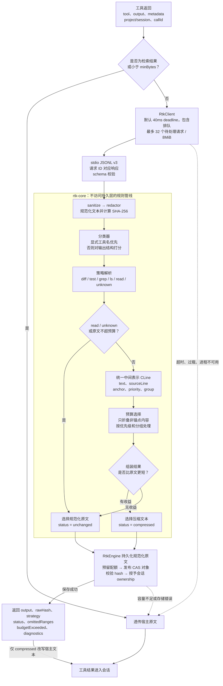
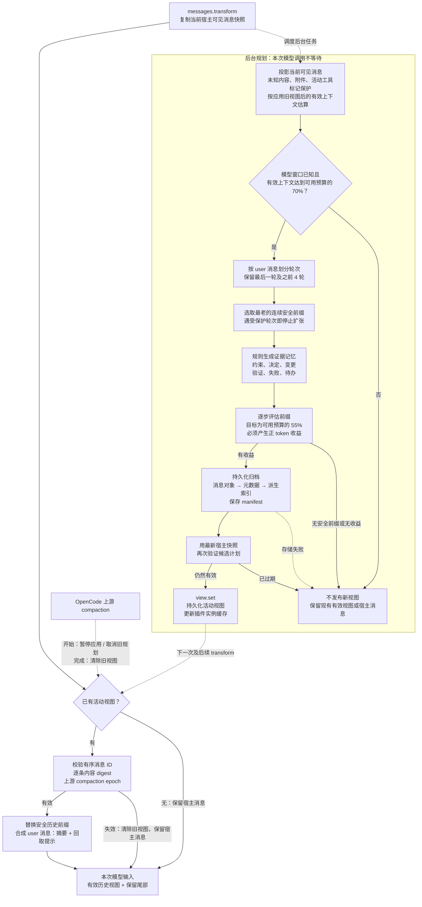

# BlueCode

为 [OpenCode](https://github.com/anomalyco/opencode) 提供上下文优化：通过一个插件挂载 RTK 工具输出压缩与 headroomd 历史归档。

[English](README.md) · [架构](docs/architecture.md) · [操作手册](docs/operations.md) · [实现与验收记录](docs/reliability-implementation.md)

本仓库是独立学习实现，不是 vivo 的 BlueCode 私有源码。评测使用本地合成数据。

## 工作方式

| 组件 | 职责 |
|---|---|
| RTK | 保守压缩已识别的命令输出，保护代码、diff 变更行和完整失败诊断。512 token 是软目标，保护内容允许超额。 |
| headroomd | 归档已完成轮次，构建证据记忆，持久化能够反复应用到新宿主消息数组的视图；保护近期轮次、活动工具及未知内容。 |
| 插件 | 每实例拥有客户端与状态，以真实 project/session 隔离检索；根据模型窗口规划，与上游 compaction 协调。 |
| 检索 | 全文分片、FTS5/BM25 搜索、经校验的归档恢复和有界游标分页；返回内容绕过 RTK。 |

RTK 使用 stdio 协议 v3，headroomd 使用 Unix socket 协议 v2。持久数据与临时 socket 分离。故障保留宿主可见内容或暂停规划；归档缺失、损坏会显式报告。RTK 保存实际收到文本的 sanitized 版本，无法恢复进入 hook 前已被宿主截去的内容。

## 实现架构

RTK 压缩单次工具返回，headroomd 归档累积的会话历史。下面三张图对应本仓库当前的 Bun / TypeScript 实现；两个 sidecar 互不调用，由宿主插件负责调度和检索路由。

### 总体架构：两层压缩与检索闭环



RTK 在工具返回后等待一次有 deadline 的压缩调用；headroomd 在后台规划，模型调用前只验证和应用已就绪的视图。宿主加载客户端与纯计算入口，数据库和归档写入留在独立进程中。检索结果明确绕过 RTK，避免刚恢复的证据再次被折叠。

源码：[插件工厂](packages/plugin/src/index.ts)、[生产运行时](packages/plugin/src/runtime.ts)、[统一检索入口](packages/plugin/src/retrieval.ts)。

### RTK 内部：规则压缩、锚点保护与原文持久化



默认 `minBytes=512` 是客户端的字节门槛，`budgetTokens=512` 是压缩的软目标，两者含义不同。策略通过 `anchor` 标记不可删除的内容：`read` 保留完整源码，`diff` 保护所有变更行和文件 / hunk 头，`test` 保护失败诊断；`grep` 和 `ls` 按结构分组折叠，`unknown` 保守透传。保护内容可以超过预算，并通过 `budgetExceeded` 报告。

CAS 保存的是 sanitize / redactor 之后的文本；默认 redactor 为 identity，不代表自动脱敏。压缩结果包含回取提示，原文保存失败则保留宿主文本。进入 Hook 前已被宿主截去的内容不在可恢复范围内。

源码：[客户端](packages/rtk/src/client.ts)、[分类器](packages/rtk-core/src/classify.ts)、[策略管线](packages/rtk-core/src/pipeline.ts)、[预算选择](packages/rtk-core/src/budget.ts)、[存储与降级](packages/rtk/src/engine.ts)。

### headroomd 内部：后台规划与活动视图重放



可用输入预算为 `min(input 上限, context 上限 − 输出预留) − 系统提示估算 tokens − 512`；缺少独立 input 上限时使用 context。窗口未知时暂停规划。在线阈值和规划使用 `ceil(text.length / 4)` 估算，离线评测才使用精确 tokenizer；检索页预算另用 UTF-8 字节数作为保守 token 上界。

记忆通过规则归类和重复折叠生成，没有调用 LLM：用户文本保持原文，工具 `input/output/error` 都参与，每条记忆保留 `sourceIds`。计划包含有序 `replacedMessageIds`、`sourceDigests`、`epoch`、摘要与归档引用。每次 transform 都重新验证并重放计划；尾部追加可以继续使用旧前缀，源消息修改、删除、重排或上游 epoch 改变会使旧计划失效。

消息对象以内容 hash 寻址，回读时校验 schema 和 hash；`meta.db` 保存归属、manifest、多代归档关系和活动视图，`index.db` 保存可重建的全文索引。替换发生在模型输入视图中，不通过这条链路删除宿主持久历史。

源码：[调度与预算](packages/plugin/src/runtime.ts)、[宿主投影与替换](packages/plugin/src/host-adapter.ts)、[归档引擎](packages/headroomd/src/engine.ts)、[记忆生成](packages/headroomd/src/memory.ts)、[计划校验](packages/headroomd/src/compaction.ts)、[活动视图持久化](packages/headroomd/src/store/manifests.ts)。完整接口见[协议](docs/protocol.md)。

## 本地运行

使用 **Bun 1.4.0**。目标平台为 Linux/macOS；本次本地验证在 macOS 完成，Linux 已配置 CI，执行状态以实际流水线为准。

```sh
bun install --frozen-lockfile
bun run verify
bun run eval --check --skip-latency
```

verify 包含全工作区 strict 类型检查、测试、依赖方向，以及宿主 bundle 不引入 SQLite 的检查。评测不需要模型密钥。

在 OpenCode 配置中挂载当前 checkout：

```json
{
  "plugin": [["file:///absolute/path/Bluecode/packages/plugin/src/index.ts", {
    "mode": "on",
    "rtk": {"budgetTokens": 512, "timeoutMs": 40, "minBytes": 512},
    "headroom": {"triggerRatio": 0.7, "targetRatio": 0.55, "retainRecentTurns": 4}
  }]]
}
```

宿主适配以已核实的 OpenCode **1.18.21** 为基准，部分 hook 属于 experimental API。参见[集成记录](docs/integration-notes.md)与[操作手册](docs/operations.md)，后者涵盖 off/shadow/on、配额、迁移和恢复。

## 回放实测

11 份 fixture、四组配置均使用生产 runtime；o200k_base 计数包括所有固定调用的重复上下文、问题和实际检索返回。

| 配置 | 总输入 token |
|---|---:|
| A：关闭优化 | 582,501 |
| B：仅 RTK | 464,781 |
| C：仅 headroomd | 529,923 |
| D：组合 | 435,436 |

默认 query-only 回放中，组合总输入减少 **25.25%**。C/D 自然问题 Recall@5 为 10/10；每组明确关键约束 3/3、确定性答案检查 10/10；D 归档逐字恢复 108/108。普通旧 fixture 上下文事实 B/D 为 102/104，单独披露。

这些是确定性内容检查，不能等同于真实 LLM 解题率或 provider 账单。主动展开全部命中文档的压力场景仅节省 **6.95%**，未达到 20% 成本门槛；32 并发时 RTK 在 40ms deadline 下发生13次降级。[完整口径、证据与限制](docs/reliability-implementation.md)、[评测 CLI](packages/eval/README.md)。

## 开发

七个工作区包分离协议、基础原语、RTK 纯策略、RTK 传输与存储、headroomd、插件及评测。评测直接依赖生产 runtime，两个 sidecar 互不依赖。旧插件 helper 保留用于兼容测试，不在生产工厂导入链路内。

参见[贡献指南](CONTRIBUTING.md)、[协议](docs/protocol.md)、[设计](docs/superpowers/specs/2026-09-05-reliability-design.md)、[实施计划](docs/superpowers/plans/2026-09-05-reliability.md)。

MIT，见 [LICENSE](LICENSE)。实现和文档由 AI 辅助完成；参考项目及许可边界列于验收记录。
