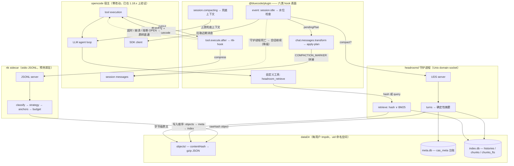

<div align="center">

# BlueCode

**[opencode](https://github.com/anomalyco/opencode) 的上下文工程 sidecar 组件** ——
在热路径上压缩工具输出，把长会话历史归档进可检索存储；
任何故障都降级为透明直通，绝不静默丢失一个字节。

[](https://github.com/EthyleneC2H4/Bluecode/actions/workflows/ci.yml)
[](LICENSE)
[](https://bun.sh)
[](tsconfig.base.json)
[](#快速开始)

[特性](#特性) · [架构](#架构) · [组件](#组件) · [快速开始](#快速开始) · [实测基线](#实测基线) · [文档](#文档)

[English](README.md) · 简体中文

</div>

---

## 为什么需要

长时间运行的 coding agent 会话会逐渐淹没上下文窗口：每一次 `ls`、`grep`、测试运行和日志
转储都原封不动地进入对话记录，轮次历史不断堆积。迟早，宿主会悄悄截断或压缩上下文——
而任务仍然依赖的细节就此中途消失。

BlueCode 通过单个 opencode 插件同时处理这两条路径，**对宿主核心零改动**：

| Sidecar | 传输方式 | 职责 |
|---|---|---|
| **rtk** | stdio JSONL，预热常驻进程 | 对每条工具结果做分类并压缩到 token 预算——保留锚点行，字节级原文入库待检索 |
| **headroomd** | Unix domain socket 守护进程 | 监控每会话 token 水位；越线时将老化轮次替换为确定性摘要，背后是可检索的 SQLite/FTS 归档 |

每一个被省略的字节都可以通过 `headroom_retrieve` 工具取回（精确哈希查找或 BM25 全文检索），
且所有失败模式都降级为*原样直通*——绝不静默丢数据。

## 特性

- **零核心改动挂载** —— 全部基于文档化的 hook 面与 opencode 的元组式插件选项
  （`"plugin": [["file://…", options]]`）。共挂载六类表面：`tool.execute.after`、
  `experimental.chat.messages.transform`、`experimental.session.compacting`、
  `event`（空闲水位）、自定义工具 `headroom_retrieve`、以及 `dispose`。
- **热路径压缩（rtk）** —— 两级分类器从六种策略
  （`ls | grep | read | diff | test`，外加对未知形态永不丢弃的兜底实现）
  中择一，按优先级保护锚点行、裁剪到 token 预算、把被省略的区段折叠为 `[+N lines elided …]`
  标记，并在改写结果上打 `metadata.bluecode { rawHash, strategy, compressed }` 标签。
- **长会话守护进程（headroomd）** —— 在 `session.idle` 时，若预估 token 超过
  `contextWindow × triggerRatio`（默认 `0.7`），即对轮次做切分、由完全确定性的抽取式摘要器
  生成摘要（无 LLM、无时钟、无随机数——字节级稳定），归档后以单条携带逐轮哈希引用的
  `COMPACTION_MARKER` 消息替换原历史。
- **无丢失检索保证** —— 原文以字节级精确的 gzip 对象存储，按逻辑内容哈希寻址（CAS + 原子发布）；
  检索支持精确哈希模式与 FTS5 BM25 查询模式（CJK 感知预切分、会话作用域谓词）。
- **故障遏制矩阵** —— 单请求超时 → 崩溃检测 → 指数重启退避 → 周期性恢复探测的熔断器；
  任一环节失败都输出打有 `metadata.bluecode.degraded` 标签的原样直通。会话毫无感知。
- **可重建存储** —— 分离持久化设计：所有权台账（`meta.db`）持久；派生搜索索引（`index.db`)
  可随时删除，启动时自检并从 CAS 对象重建。
- **可复现评测 harness + 回归门禁** —— 四组对照驱动真实 sidecar 客户端跑确定性种子 fixture，
  精确 o200k_base 计数；基线门禁（`--check`）让质量回归直接挂掉 CI。

## 架构



三条数据路径：

1. **热路径（同步）** —— 每次工具调用完成后流经 rtk；压缩文本在模型看到之前被原地改写。
   ≤ 512 字节的输出走客户端本地快路径，完全不产生 IPC。
2. **空闲路径（异步）** —— 会话空闲且水位越线时，headroomd 归档并摘要老化轮次；
   计划在下一次消息 transform 时应用。
3. **检索路径** —— 模型调用 `headroom_retrieve`：给 rawHash 取回字节级原文，
   或给自由文本查询得到 BM25 排序命中。

任一 sidecar 在会话中途中死，对应路径优雅降级——rtk 变直通、headroomd 暂停压缩——
会话其余部分照常进行。重启宿主即可恢复故障组件。

## 组件

| 包 | 职责 | 亮点 |
|---|---|---|
| [`@bluecode/contracts`](packages/contracts) | 双协议 wire schema 与共享错误码 | zod schema、ChatMessage 投影 |
| [`@bluecode/shared`](packages/shared) | 基础原语 | JSONL 分帧、CAS、ANSI 剥离、精确 token 计数、脱敏挂点 |
| [`@bluecode/rtk-core`](packages/rtk-core) | 纯函数压缩管线 | 分类器 + 六策略 + 锚点保护 + 预算裁剪（无 I/O） |
| [`@bluecode/rtk`](packages/rtk) | stdio JSONL sidecar | 预热 server + 降级矩阵客户端（预热 / 超时 / 重启 / 熔断） |
| [`@bluecode/headroomd`](packages/headroomd) | UDS 历史守护进程 | 轮次切分、确定性摘要、SQLite/FTS 归档、启动自愈 |
| [`@bluecode/plugin`](packages/plugin) | opencode 插件 | 六类 hook 表面接入两个 sidecar——零核心改动 |
| [`@bluecode/eval`](packages/eval) | 评测 harness | A/B/C/D 四组 runner、golden-fact 指标、基线固化 + 门禁 |

源码约 8.7k 行，测试约 6.0k 行、37 个测试文件。依赖方向：
`plugin → {rtk, headroomd} → {contracts, shared}`——叶子包互不依赖。

## 快速开始

需要 [Bun](https://bun.sh) ≥ 1.4（实测于 Bun 1.4.0）。构建、测试、评测均无需 LLM API key，
仅真实会话需要。

```bash
git clone https://github.com/EthyleneC2H4/Bluecode.git bluecode
cd bluecode
bun install

bun run verify            # 全仓 typecheck + 完整测试套件
bun run eval --quick      # 缩减 fixture 集（harness 冒烟）
bun run eval              # 完整 A/B/C/D 跑批 → packages/eval/eval-report.json
bun run eval --check      # 对照 packages/eval/baseline.json 的回归门禁（违规退出码 1）
```

### 挂载到真实 opencode 项目

在项目 `opencode.json` 中加入元组式条目（路径必须是指向检出 `packages/plugin` 的绝对
`file://` URL）：

```jsonc
{
  "plugin": [
    [
      "file:///absolute/path/to/bluecode/packages/plugin",
      {
        "enabled": true,
        "rtk":      { "budgetTokens": 512, "timeoutMs": 40, "minBytes": 512 },
        "headroom": { "triggerRatio": 0.7, "retainRecentTurns": 4, "fallback": "upstream" }
      }
    ]
  ]
}
```

然后在临时目录启动 opencode。实机验证按 [`scripts/smoke.md`](scripts/smoke.md) 的十步清单执行。

> [!NOTE]
> Hook 兼容性针对 **opencode 1.18.x** 验证。部分挂载表面是上游 `experimental.*` API，
> 后续 opencode 版本可能变动。

## 实测基线

冻结评测基线（[`packages/eval/baseline.json`](packages/eval/baseline.json)，固化于 2026-08-24）：
完整 fixture 集（每组 10 个确定性 fixture）、精确 o200k_base 计数、Bun 1.4.0。随时可用
`bun run eval --check` 复现。

| 组 | 配置 | 压缩率¹（越低 = 上下文越小） | 关键事实召回² | 降级率 |
|---|---|---:|---:|---:|
| A | passthrough 基线 | 100% | — ⁵ | 0 |
| B | rtk only | **35.6%** | 75/94（79.8%） | 0 |
| C | headroomd only | **36.5%** | 88/94（93.6%） | 0 |
| D | combined（rtk → headroomd） | **9.0%** ⁶ | 74/94（78.7%） | 0 |

长会话 fixture 上，headroomd 将累计历史从 **51,083 → 273 tokens**。

<details>
<summary><b>方法论与注意事项</b></summary>

1. **压缩率** = Σ outTokens / Σ rawTokens，按组内 fixture 做 token 加权，精确 o200k_base 计数
   （每组原始总量 80,034 tokens；B 输出 28,479、C 输出 29,224、D 输出 7,223）。
2. **召回**采用本项目刻意宽松的定义——*"能从 headroomd 取回即视为未丢失"*：golden fact 只要在
   压缩输出、任一检索片段或其按哈希取回的原文中以子串形式出现即算命中。逐项 miss 清单见
   `eval-report.json → perFixture[].recallMisses`。次重要召回：B 17/23、C 21/23、D 17/23。
   B/D 的残余 miss 是刻意的中间窗口截断策略；C 的残余 miss 是新于 `retainRecentTurns` 的尾部轮次。
3. 冻结基线覆盖 **完整 fixture 集**（每组 10 个确定性 fixture，mulberry32 播种，可字节级复现）。
   `bun run eval --quick` 跑缩减冒烟集。
4. 延迟为 harness 内分阶段测量（合成 fixture 上的 IPC 耗时），数值收录于 baseline JSON，
   但刻意**不**宣传为端到端提速。C 的极小 p50 是因为单条工具输出几乎不会触及压缩水位——
   设计如此，小输出本就不该动。
5. A 组不做任何变换，因此不探测 golden fact。
6. **D 为下界近似**：harness 对两个阶段独立测量（摘要基于 rtk 处理前的历史计算），
   而真实插件链路中 headroom 经 SDK 读到的是 rtk 改写后的会话——实际组合收益应 ≥ 9.0%。
7. 本仓库的一切量化主张均可追溯至 [`packages/eval/baseline.json`](packages/eval/baseline.json)；
   期望值一律标注「目标」，绝不与实测混排。

</details>

## 文档

| 文档 | 内容 |
|---|---|
| [`docs/architecture.md`](docs/architecture.md) | 包布局、rtk/headroomd 数据流、关键设计决策 |
| [`docs/protocol.md`](docs/protocol.md) | wire 协议规范：rtk over stdio JSONL、headroomd over UDS——帧格式、操作、错误 |
| [`docs/integration-notes.md`](docs/integration-notes.md) | opencode v1.18.21 上游 hook 核实记录（精确 file:line 引证） |
| [`docs/devlog.md`](docs/devlog.md) | 开发日志：最难 bug、根因、修复与教训 |
| [`scripts/smoke.md`](scripts/smoke.md) | 十步实机会话验证清单 |
| [`scripts/refresh-upstream.sh`](scripts/refresh-upstream.sh) | 刷新用于 hook 核实的只读 opencode 上游快照 |

## 项目结构

```
bluecode/
├── package.json              # bun workspace 根: test / typecheck / eval / verify
├── tsconfig.base.json
├── docs/                     # 架构、协议、集成笔记、开发日志
├── scripts/                  # 冒烟清单 + 上游快照刷新脚本
└── packages/
    ├── contracts/            # wire 协议 zod schema 与错误码
    ├── shared/               # JSONL 分帧、CAS、ANSI 剥离、token 计数
    ├── rtk-core/             # 纯函数压缩管线
    ├── rtk/                  # stdio sidecar server + client
    ├── headroomd/            # UDS 守护进程 + SQLite/FTS 归档
    ├── plugin/               # opencode 插件（六类 hook）
    └── eval/                 # A/B/C/D harness + 基线门禁
```

## 参与贡献

欢迎 Issue 与 Pull Request。提交前请执行：

```bash
bun run verify          # typecheck + 测试
bun run eval --check    # 评测回归门禁
```

仅在有意图的行为变更时重新固化评测基线（`bun run eval --update-baseline`），
并在 PR 中说明。

## 致谢

- [opencode](https://github.com/anomalyco/opencode) —— BlueCode 所接入的开源 coding agent。
  其插件机制、hook 表面与 SDK 数据结构使这套零核心改动的设计成为可能。
- 构建于 [Bun](https://bun.sh)、TypeScript、zod 与 SQLite/FTS5 之上。

## 许可证

[MIT](LICENSE) © wangyixi
