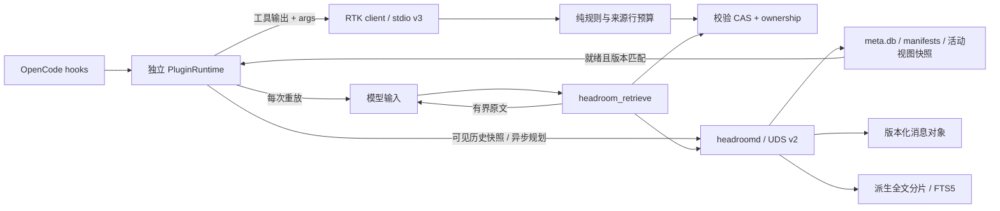

# BlueCode 架构（可靠工程版）

本仓库是基于 OpenCode 插件接口的独立上下文工程实现。运行时保持 Bun/TypeScript、RTK stdio 子进程与 headroomd UDS 守护进程；宿主源码保持只读。以下描述对应源码与回归测试，完整交付证据见 [实现与验收记录](reliability-implementation.md)。

## 模块与依赖

| 包/入口 | 责任 |
| --- | --- |
| `contracts` | RTK v3 / headroom v2 wire schema 与消息投影 |
| `shared` | 每帧 UTF-8 JSONL、经校验 CAS、分页、路径、文件计量 |
| `rtk-core` | 分类、来源行、保护块、预算选择；不访问持久层 |
| `rtk/client` | 预热、带排队时间的 deadline、重启 generation、过载旁路 |
| `headroomd/client` / `headroomd/pure` | 宿主可加载的通信/投影计算入口 |
| `headroomd` | 归档、版本化内容摘要、证据记忆、索引、持久活动视图 |
| `plugin/runtime` / `plugin/host-adapter` | 实例状态、真实 namespace、宿主消息保护与视图重放 |
| `plugin/retrieval` | 项目隔离、检索路由、最终 JSON 预算、禁止检索结果再压缩 |
| `eval` | 通过生产 runtime/retrieval 执行四组连续回放及严格门禁 |

`eval → plugin → client/pure`；服务端不依赖插件。`bun run check:deps` 验证声明依赖；`bun run check:host` 打包实际插件工厂，拒绝 SQLite 进入宿主 bundle。实现见 [工厂](../packages/plugin/src/index.ts)、[运行时](../packages/plugin/src/runtime.ts) 与 [入口检查](../scripts/check-host-imports.ts)。

## RTK：保护优先于软预算

分类器根据工具、输出结构和安全参数选择策略。每条保留行带一基来源行号；生成的汇总行不冒充来源行。代码读取保留完整源码；普通 diff 的变更与 hunk/header 是硬锚点；combined diff 与不确定格式旁路。失败块中的快照、未缩进详情、错误码等持续受保护，形似通过标记的诊断不会终止失败块。明确通过的测试行和可删的上下文可折叠。[策略与预算实现](../packages/rtk-core/src/strategies)、[回归](../packages/rtk-core/test/reliability.test.ts)。

默认目标 512 估算 tokens 是软预算。`unchanged`/`skipped` 是正常状态，不能计作故障；保护内容可能使 `budgetExceeded=true`。密集失败的扫描是线性的，预算使用预计算分组与排序，无逐步重算全文的平方路径。

请求自入队起计算默认 40ms deadline，最多 32 个请求/8MiB；排队过期直接旁路。已发送但超时的请求继续占用传输槽，避免队列洪泛；若 1 秒内仍没有迟到响应，退出当前 generation 并重启。客户端 deadline 无法抢占已在执行的同步 JavaScript。[客户端](../packages/rtk/src/client.ts)。

CAS 对存在的对象逐字节校验；新对象写临时文件、fsync、独占发布并同步目录，再授予所有权。相同根上的 RTK 进程在 SQLite 独占发布锁内先提交配额 reservation，再写对象；仅持锁时回收没有对象的 pending reservation，崩溃后自动释锁并在下次发布时恢复。已发布对象继续计量。RTK 限额约束规范化对象 payload，元数据库有额外开销。

## headroom：可重放的活动视图

宿主每次可能重新创建原始消息数组。插件缓存/持久化的是可验证计划，成功应用后继续保留，在以后每次 transform 上重放。计划覆盖有序 IDs、完整内容 digests 与 upstream epoch；尾部追加允许应用，覆盖区域修改、缺失、重排或 epoch 改变会使它失效。

计划来自真实 `messages.transform` 的原始可见快照；是否触发按应用旧视图后的有效上下文估算。SDK 的未过滤 `session.messages` 不参与自动规划，以免上游已隐藏历史重新进入模型。压缩期间暂停 headroom 应用；向上游 compacting 注入记忆前再次验证当前可见源。[宿主适配](../packages/plugin/src/host-adapter.ts)、[上游记录](integration-notes.md)。

模型窗口来自当前 provider/model 的真实 `limit.context/input/output` 与输出预留；未知窗口暂停。默认在可用输入预算的 70% 触发，目标 55%，保护最近 4 个已完成轮次和最后一轮。未知 part、附件、正在运行或状态未确认的工具所在轮受保护。仅选择正收益的安全前缀；不能达到目标时报告预算状态。

证据记忆按约束、决定、变更、验证、失败、待办归类，用户要求保留原文；工具 input/output/error 都参与记忆和估算。assistant 精确重复片段可计数折叠。新一代归档合并已有结构化记忆，history 检索沿 namespace 内 lineage 展开原始消息；测试覆盖 2/5/20 代。[记忆](../packages/headroomd/src/memory.ts)、[多代测试](../packages/headroomd/test/continuation.test.ts)。

`meta.db` 使用 FULL synchronous 保存归属、manifest 和活动视图的完整快照；新候选不会改写已发布视图。独占 writer lease 绑定实际持久根，多个 socket 也不能同时写同一根。`index.db` 是派生数据，坏 SQLite 被隔离；分片 inventory、FTS 对应关系与对象版本校验帮助发现部分索引丢失并重建。[持久层](../packages/headroomd/src/store)、[审查回归](../packages/headroomd/test/review.test.ts)。

## 检索与资源边界

全文以自然边界分片，目标约 512 估算 tokens、重叠约 64；偏移是 UTF-16 索引。查询保留技术词与 CJK 处理，过滤常见英文问句停词，BM25 的 namespace 谓词与检索在同一 SQL 中。重叠命中合并；query cursor 绑定有序命中内容摘要，结果发生变化时明确拒绝旧 cursor。

默认每页 2048 tokens / 32KiB，硬上限 8192 / 128KiB，取先到者。热路径以 UTF-8 bytes 作为保守 token 上界，离线评测用精确 tokenizer。history 可以在同一消息内部翻页。生产工具还将 JSON envelope、引用和 cursor 计入输出预算；如果预算容不下 envelope，会返回有界错误而不截断后跳过尾部。[分页](../packages/shared/src/paging.ts)、[检索](../packages/plugin/src/retrieval.ts)。

默认 dataDir 为系统应用数据目录，socket 位于短路径的用户私有 runtime 目录；显式 dataDir 保持有效。插件默认将 1GiB allowance 分配给两个组件各 512MiB；headroom 包含文件/SQLite 开销并保守预留，RTK 按规范化 payload reservation 计量，因此它不是操作系统硬磁盘配额。已有引用不自动驱逐，GC 只收集超过 24 小时的临时发布文件。[运维说明](operations.md)。
