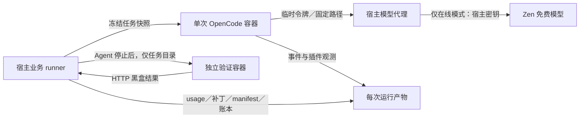

# 订单与售后业务评测

本评测针对公开学习重构仓库，不代表 vivo 私有 BlueCode 或真实电商生产系统。目标是在同一业务任务、免费模型、预算与安全策略下，对照关闭压缩和 RTK＋Headroom 组合的交付正确性、provider usage 与耗时。正确性只由容器外的 HTTP 验收判定，不能由回答中的关键词或公开单元测试代替。

## 业务契约和独立验收

最小 Bun 服务在 [`packages/eval/fixtures/order-after-sales/`](../packages/eval/fixtures/order-after-sales/)；每次运行从独立快照开始，使用固定种子和整数分金额。三个任务各有 [`TASK.md`](../packages/eval/fixtures/order-after-sales/tasks/) 和 `seed.json`：

| 任务 | 核心约束 | 外部验收 |
| --- | --- | --- |
| T1 创建订单 | 服务端价格、库存非负、请求幂等、并发不超卖 | 价格、重试／冲突、非法输入、竞争库存 |
| T2 取消订单 | 仅 `PENDING` 可取消，重复取消不重复释放，状态与库存同成同败 | 首次及重复取消、已支付／已发货拒绝、未知订单 |
| T3 部分退款 | 仅 `PAID` 可退，累计数量／金额不越界，金额等于单价乘数量，重试幂等 | 累计边界、重试／冲突、输入边界、非法状态 |

服务只模拟单进程本地事务、支付状态与无优惠订单，不实现真实支付、物流或多商家规则。独立验收器及参考修复位于 `packages/eval/src/`，未复制到 Agent 工作目录或镜像。有效性检查的本地记录是[三份参考修复全部通过、九份错误实现全部被拒绝](../packages/eval/evidence/order-after-sales/acceptance-validity.json)。这是验收器有效性证据，不是模型任务通过率。

## 执行与数据边界



每次运行有独立目录、会话、XDG 配置／数据和短期令牌。Agent 镜像固定 Bun 1.4.0、OpenCode 1.18.23 与本仓库生产模块；只挂载本次任务和产物，不挂载宿主密钥、上层源码或 Docker socket。代理只接受绑定 run、模型和路径的请求，限制请求体、有效期、八次调用、单次约 40k 输入窗口和 2048 输出上限；真实 Zen 密钥只在宿主注入，关闭上游重定向。容器结束撤销令牌并清除令牌文件；`cleanup` 在证据归档后移除工作快照和临时配置／缓存。

Baseline 为 `mode: off`，Combo 为 RTK 与分层 Headroom 开启；两组 `security.mode: enforce`，且均关闭宿主自动 compaction。安全扣留量与压缩量分开记录。Headroom 的生成、应用和后续请求实际消费分别观察；仅配置开启不等于机制生效。运行产物包括配置快照、镜像／任务／评测器摘要、脱敏补丁、OpenCode 事件、插件轨迹、独立验收 JSON、请求 usage、结果和汇总。插件观测保存原始／变换后长度及判定，不把未脱敏的原始工具输出复制进公开轨迹；原始输出细节只能在隔离现场查看。

实际输入、输出和缓存 token 只采用 provider 返回值；缺失时写 `null`。代理的序列化请求大小估计和预算预留是独立字段，不是实际 token。40k 输入限制先以请求估算拦截，provider 返回 usage 后再识别真实窗口超额，因此边界附近仍依赖提供商实际计数。按自然任务与压力任务分别汇总，且各自按组列出完整分母、通过数、实际 usage、耗时和失败分类。两次重复采用 AB／BA 次序。

## 复现

从仓库根目录执行，需 Bun 1.4.0 与可运行的 Docker：

```sh
bun run eval:business plan
bun run eval:business validate --output /tmp/business-acceptance-validity.json
bun run eval:business:build
bun run eval:business offline --single T3-pressure-combo-0 --output /tmp/business-offline
bun run eval:business summary --output /tmp/business-offline
bun run eval:business cleanup --single T3-pressure-combo-0 --output /tmp/business-offline
```

离线假模型只验证容器、代理、插件、工具和验收器的执行链路，不会修复业务代码。压力输入先用固定的 14 轮历史与一次长工具输出校准机制；正式在线实验冻结之后不得根据结果改题。在线批次仅在再次核查 [OpenCode Zen 官方免费模型定价](https://opencode.ai/docs/zen/#pricing)且宿主具备免费模型凭据时运行：

```sh
BLUECODE_ZEN_API_KEY=<仅宿主可用的凭据> bun run eval:business run \
  --free-checked-at YYYY-MM-DD --output /tmp/business-online
```

命令不会自动切换付费模型。每次最多八次模型请求、十分钟，全部 16 个冻结运行写入账本；失败仍保留。在线完成后应从原始 run 检查一个真实成功案例和一个失败案例，再写自然任务与压力任务报告。小样本只能支持这批任务的观察与机制解释。

## 当前证据与未完成项

截至 2026-09-27，本机未发现 Zen 免费模型凭据，故 [16 项在线运行均为 `not_run`](../packages/eval/evidence/order-after-sales/online-pending.json)：自然任务 12 项、压力任务 4 项。当前没有在线正确率、实际 provider token 对照或成功 Agent 案例，不能填写收益百分比。

[单次离线 T3 压力轨迹](../packages/eval/evidence/order-after-sales/offline-pressure/result.json)显示真实 OpenCode 宿主、插件和两个工具调用完成；RTK 将一段 18,274 字符的可识别输出变为 280 字符，Headroom 视图已生成、应用并被后续请求消费，安全扣留为 0。假模型未修改业务代码，外部验收失败；provider usage 为 `null`，这条记录只证明机制链路，不证明交付收益或 token 节省。相关[请求记录](../packages/eval/evidence/order-after-sales/offline-pressure/request-usage.json)、[脱敏事件](../packages/eval/evidence/order-after-sales/offline-pressure/events.jsonl)与[插件轨迹](../packages/eval/evidence/order-after-sales/offline-pressure/trace.jsonl)可逐项复核。

**AI 使用说明：**业务契约、实现、测试和本文由 AI 辅助编写，结论以本仓库可运行代码、独立验收和保留的原始记录为准。在线业务结果尚未生成。
