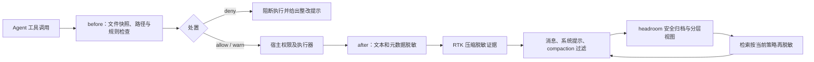

# VSecAgent：工具检查与脱敏归档

本实现为 OpenCode Agent 工具链增加本地安全检查，使用独立 Bun 扫描子进程。默认不调用 LLM，不上传源码；不宣称提供完整 SAST、网关防火墙或操作系统沙箱。依据[批准设计](superpowers/specs/2026-09-17-vsecagent-design.md)实施，压缩算法保持原样。

## 配置与执行顺序

使用[安全配置示例](../examples/opencode-security.json)，替换插件绝对路径。`security.mode` 未配置时为 `off`，兼容既有用户。`audit` 记录拟阻断发现并允许工具继续，仍执行脱敏；`enforce` 阻断高置信 CRITICAL 风险并执行故障策略。压缩的 `mode: off`、`rtk.mode: off`、`headroom.mode: off` 均不关闭安全；`enabled: false` 关闭整个插件。



安全检查先于 RTK 的字节门槛，短输出也过滤。`headroom_retrieve` 绕过 RTK，但不绕过安全。历史脱敏先于快照、内容摘要和来源哈希；发布已生成视图前再次检查，不在哈希生成后修改节点。安全报告每次最多追加约 256 个估算 token。

源码入口：[配置](../packages/plugin/src/config.ts)、[工具适配](../packages/plugin/src/security-tools.ts)、[过滤器](../packages/plugin/src/security.ts)、[生产运行时](../packages/plugin/src/runtime.ts)。

## 检测范围

| 类别 | 支持的初版范围 | 默认处置 |
|---|---|---|
| 凭证 | 常见令牌格式、私钥块、连接密码、敏感赋值；排除明确占位符 | 新增已知格式或明确高熵敏感赋值 CRITICAL 阻断，模糊赋值 HIGH 告警；可识别内容脱敏 |
| 危险命令 | Bash AST 中危险递归删除、磁盘覆盖、系统权限更改、远程下载到解释器 stdin；常见包装及最多两层字面量 shell | 高置信严重行为阻断；动态展开、复杂未知结构报告部分覆盖 |
| 敏感文件 | `.env`、私钥、凭证文件与策略禁止位置 | 确认访问阻断；模板、公钥单独处理 |
| 路径穿越 | 宿主规范化路径、realpath、新文件最近现存父目录、项目根边界 | 出项目根或命中禁止位置时阻断；项目内 `../` 允许 |
| 动态执行 | JS/TS 中 eval、Function、已支持的 VM／shell／字符串定时器调用 | HIGH／MEDIUM 告警 |
| SQL 注入 | 已支持 query/execute/raw 等调用中的拼接、模板插值 | HIGH 告警；参数化调用为负例 |
| XSS | innerHTML、outerHTML、srcdoc、document.write、已支持 JSX/jQuery 接口 | HIGH 告警；静态文本及已知 HTML 净化调用单独处理 |
| 弱加密 | 弱算法、短 RSA、低 KDF 成本、固定 IV、敏感语境下的伪随机 | MEDIUM／HIGH 告警；不将所有随机数用于普通模拟的情况判为密码风险 |

高熵赋值规则只作用于明确的敏感字段：值至少 20 字符、至少 3 类字符、12 个不同字符、Shannon 熵至少 3.5，排除空白和明确占位符。它是本地置信启发式，不验证凭证是否真实有效；普通疑似赋值仍告警。

JS/TS/JSX/TSX 使用 TypeScript 5.9.3 `createSourceFile` 和 AST 遍历，不启动项目类型检查。Bash 使用固定版本 `web-tree-sitter@0.25.10`、`tree-sitter-bash@0.25.0` 的本地 WASM。源码：[纯规则包](../packages/security-core/src/index.ts)。

`write` 比较完整候选和原文；保留的旧问题仍报告，但旧凭证不冒充新增凭证。`edit` 精确重建可成立时扫描完整结果，否则扫描新增片段并标记部分覆盖。`apply_patch` 检查所有新增片段、目标及移动路径，任一严重发现拒绝整次调用。不会修改提交的命令或代码。

非 JS/TS 源码仍有通用凭证与路径检查。未知 MCP、动态命令、模糊编辑和附件不能被表示成完整语义分析；`coverage` 为 `partial`／`unsupported`，与服务故障分开。

## MCP 映射和策略例外

用户配置受信任的字段映射；不信任工具自己声明 `readOnly`：

```json
{
  "security": {
    "mode": "enforce",
    "policy": {
      "version": "team-policy-1",
      "deniedPaths": ["/project/private"],
      "mcpTools": {
        "company_save": {
          "operation": "write",
          "pathFields": ["document.path"],
          "contentFields": ["document.content"]
        }
      },
      "exceptions": [{
        "ruleId": "dynamic-execution.code-string",
        "scope": "/project/test/fixtures",
        "reason": "Intentional security-analysis fixture",
        "expiresAt": "2026-12-01T00:00:00Z"
      }]
    }
  }
}
```

例外使用精确规则 ID、绝对路径子树（可带 `/**`）、`tool:工具名` 或 `*` 范围，必须注明原因及到期时间。推荐最小路径范围。例外只影响风险处置，不豁免脱敏。策略随插件初始化读取，修改后重启 OpenCode；完整策略参与缓存和存储指纹，到期例外不能复用过期的允许结果。

## 故障、资源和审计

默认请求期限 1 秒，包含扫描队列；启动握手单独计时。最多 32 个待处理请求、8 MiB 队列数据；每个代码／文本字段最多 1 MiB。超过限制不扫描前缀冒充成功。超时终止整个扫描进程代次，拒绝迟到结果；后续请求重新启动。16 MiB 内存缓存按项目、会话、内容、完整策略与解析器版本隔离。

| 状况 | 处置 |
|---|---|
| enforce 下扫描故障，写入／命令／未知副作用工具 | 拒绝本次执行，服务恢复后重试 |
| 明确只读工具扫描故障 | 可继续执行，结果仍必须通过脱敏 |
| 脱敏故障或文本超过上限 | 用内容暂不可用提示替代整个对应文本；RTK 不把这次减少记成压缩 |
| 语法覆盖不足 | 报告部分覆盖和已发现风险，保留宿主权限控制 |
| 可选摘要服务失败或摘要无法安全处理 | 继续使用已验证的规则结果 |

请求与响应使用独立 JSONL v1，包含 ID、策略版本、排队／扫描耗时。审计按大小轮转，只记录规则、决策、耗时、版本摘要、请求 ID 和固定错误类别；不记录命令、源码、参数或凭证。位置不写入审计路径文本，避免文件名本身泄密。

企业防火墙与脱敏 SDK 通过独立注入接口适配；模拟服务测试超时、异常响应和处置映射。首版不猜测私有服务 URL、认证或字段，也不宣称企业生产接入已验收。源码：[子进程包](../packages/vsecagent/src)、[适配接口](../packages/vsecagent/src/adapters.ts)。

## 归档与恢复语义

安全开启时使用 `dataDir/security-v1/<策略指纹>/` 下的独立 RTK／headroom 空间和策略专属 socket。自定义旧 headroom socket 不被复用。旧未脱敏目录保留，不自动回退、迁移或删除。headroom 记录策略绑定，拒绝改用另一策略或关闭安全后直接打开该目录。

RTK 的哈希基于收到的脱敏规范文本。headroom 的 CAS、FTS、摘要输入及摘要输出在持久化前校验；可选 LLM 新生成内容先脱敏再构建摘要节点，避免哈希与正文不一致。FTS 重建同样检查派生字段。分页继续使用来源游标，不按脱敏后文本长度推算偏移。

开启安全后，“逐字恢复”指脱敏后的完整证据，不包含敏感原文。此保证覆盖本项目新增持久层与过滤后的模型文本，不表示 OpenCode 的原始会话数据库、手工终端历史已被清理。

## 覆盖限制与验证方法

Hook 能阻断经过该入口的 Agent 工具请求。用户手动 shell、命令模板提前执行的 shell、后续插件修改参数、文件检查后的竞态，以及图片／二进制／未知附件不是本地文本扫描器的完整控制范围。插件按已知工具和消息结构工作；升级 OpenCode 后需要重跑宿主测试。不修改 vendored OpenCode。

复现质量门禁：`bun run check:security`；固定机器性能：`bun run eval:security --performance --output /tmp/vsec-performance.json`；已安装 OpenCode 1.18.23 时运行本地模拟模型宿主：`bun run eval:security:host /tmp/vsec-host.json`。详见[规则与性能报告](vsecagent-evaluation.md)及[宿主、归档和兼容性验收](vsecagent-integration.md)。

回归测试包含扫描子进程故障、超时重启、队列、策略缓存、正常编辑与凭证删除、多文件补丁、结构化元数据、脱敏幂等及完整归档链路。真实宿主测试使用本地模拟模型，禁止外部 LLM 调用；危险字符串仅送入规则或模拟执行器。验收样例、性能和安全开关消融分别报告，安全拦截／遮蔽带来的 token 减少不计为压缩收益。

本指南、实现与测试由 Codex 辅助完成。机制与效果以源码、可执行测试和实测报告为依据；合成样例通过不代表任意项目或未知漏洞的覆盖率。
